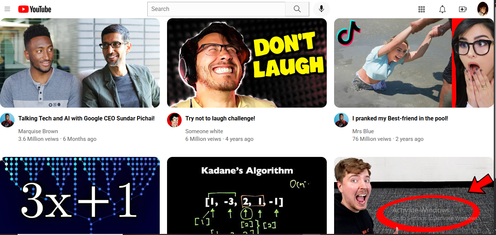

# YouTube Homepage UI Clone 🎬

A fully responsive **frontend clone** of the YouTube homepage created using **HTML5** and **CSS3**. This project replicates the structure and layout of YouTube’s interface, aiming to sharpen core frontend skills like **CSS styling, layout techniques**, and **responsive design**.

## What This Project Is

This is a **static clone** of YouTube's homepage built purely with **HTML** and **CSS**. It includes a navigation bar, sidebar, and a video grid section — all styled and laid out using modern CSS techniques like **Flexbox** and **CSS Grid**.

>  This is a UI-only project with no JavaScript functionality. It is intended for learning and demonstration purposes only.

---

## What I Learned

While working on this project, I significantly improved my understanding of:
- ✅ Page structuring using semantic HTML
- ✅ Layout design using **Flexbox** and **Grid**
- ✅ Styling elements with clean, organized CSS
- ✅ Responsiveness and mobile-first design concepts
- ✅ Attention to pixel-perfect UI details

---

## Technologies Used

- **HTML5** – for page structure and layout
- **CSS3** – for styling and responsiveness
- **Flexbox** – for aligning elements and building horizontal/vertical layouts
- **Grid Layout** – for organizing the video content into clean rows and columns

---

## License
This project is for educational purposes only and is not affiliated with YouTube or Google.

## Credits
Inspired by YouTube’s homepage design.

# Output
